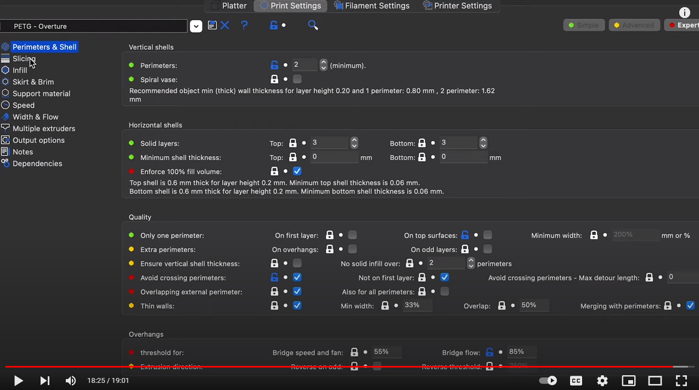

- Based off default PETG profile in Flash Print
- Height of 0.15mm in offset is to take into account the tape on the build platform

[Test your 3D printer! v3 by ctrlV](https://www.thingiverse.com/thing:1363023/files)

## Attempt #1

- Changes
  - 100% extrusion ratio
  - 0.2mm layer height
  - 0.3mm first layer
  - rather high z offset (~0.5mm in total)

## Attempt #2

- Changes
  - Reduced layer height to 0.1mm
  - First layer height of 0.28

## Attempt #3

- First layer height of 0.28mm (reduction of 0.02)
  - Based purely off other people’s profiles, no real reasoning behind it
- Adjusted the z-offset live, settled on about 0.15mm + 0.26mm = 0.41mm
  - This was the lowest offset I could use without colliding with existing filament resulting in build up around the nozzle

Under extruded at the beginning of each layer or after travel without extrusion

Over extruded at the end before retraction

Layer height seemed perfect

## Attempt #4

Attempting to address under extrusions at beginning, blob at end

[Under extrusion when starting outer wall](https://3dprinting.stackexchange.com/a/10710)

- Increase travel speed
- Increase retraction distance and speed
- Increase acceleration
- What is extra restart length
- Disable only retract when crossing outline

- Changes
  - Added extra retract length 0.1
  - Increased retract speed to 40mm/S (increase of 5mm/s)

- Outcomes
  - First layer/brim measured fairly close to correct height
  - No longer have gaps after travel (underextrusion at start)
  - Still seem to have blobs in some places

  ## Flow rate

  [[Flow Calibration Cube|3d-printing.calibration-tests#flow-calibration-cube]]

- Measurements:
  - 0.86
  - 0.86
  - 0.85
  - 0.86

- Ratio of expected wall thickness to actual wall thickness:
  - $0.80/((0.86 +0.86 + 0.85 + 0.86)/4) = 0.93$
- New flow rate = $0.93 \times 0.96 \approx 0.89$

Regex for finding commands that don't end with a hotend index
^M140 S\d+ +$

$0T0