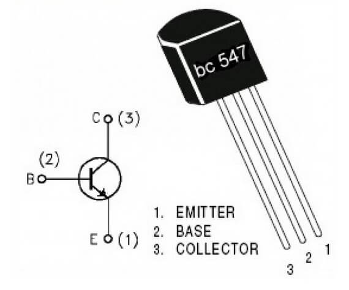

- BC547 is a bipolar junction transistor (BJT).
- It is kind of an NPN transistor.
- It has three terminals: Emitter, Collector and Base.
- The maximum current gain of BC547 is 800A.
- The Collector−Emitter Voltage is 65V.
- The Collector-Base Voltage is 80V.
- The Emitter-Base voltage is 8V.

Soure: [BC547 Transistor Basic Knowledge, Pinout and Application - Latest Open Tech From Seeed](https://www.seeedstudio.com/blog/2020/09/10/bc547-transistor-basic-knowledge-pinout-and-application/)