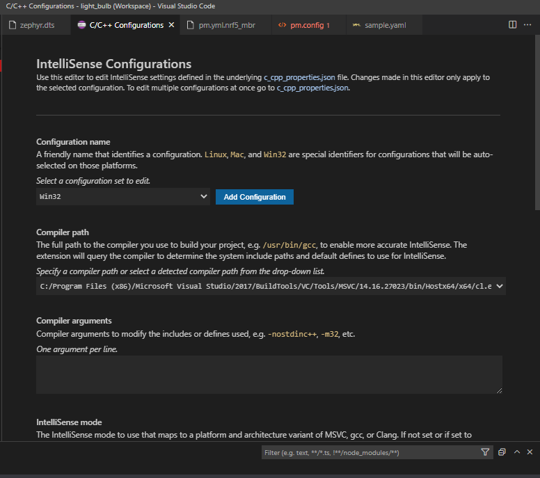

## Getting Started with ZigBee

[Adding ZCL clusters to application; nRF Connect SDK 1.8.99 documentation](https://developer.nordicsemi.com/nRF_Connect_SDK/doc/latest/nrf/ug_zigbee_adding_clusters.html#ug-zigee-adding-clusters)

- Uses the template found here - [Zigbee: Template; nRF Connect SDK 1.8.99 documentation](https://developer.nordicsemi.com/nRF_Connect_SDK/doc/latest/nrf/samples/zigbee/template/README.html#zigbee-template-sample)
  - Contains sample code to download
    - [ ] Try the sample code for the coordinator and change to router
    - [ ] Also try the CLI example
  - Contains explanation of project changes to accomodate building for the dongle

## Porting nRF52840 DK projects to the dongle

- [[ee.nrf52840.dk]] to [[ee.nrf52840.dongle]]

[How to port the Zigbee Network Coordinator sample from the nRF52840DK to the nRF52840 dongle](https://devzone.nordicsemi.com/f/nordic-q-a/84072/how-to-port-the-zigbee-network-coordinator-sample-from-the-nrf52840dk-to-the-nrf52840-dongle)
DK based projects do not work on the dongle by default

- Create an overlay to provide access to necessary peripherals
  - [ ] Check for this in blinky project for dongle
- Create partitions for MBR and the bootloader on the Dongle [Partition Manager; nRF Connect SDK 1.8.99 documentation](https://developer.nordicsemi.com/nRF_Connect_SDK/doc/latest/nrf/scripts/partition_manager/partition_manager.html)
  - They are **not** necessary on the DK and thus likely aren't included in those projects
  - [ ] Check for this in blinky project for dongle

Compare build logs between both projects

- [ ] is `pm.yml` actually being used
- [ ] Does ZBOSS get included
- [ ] Are the overlays merged?

### 2022.02.10 - Successfully created a dongle lightbulb router using an example project

Using the example code for a [[ee.zb.coordinator]] found in this thread [How to port the Zigbee Network Coordinator sample from the nRF52840DK to the nRF52840 dongle](https://devzone.nordicsemi.com/f/nordic-q-a/84072/how-to-port-the-zigbee-network-coordinator-sample-from-the-nrf52840dk-to-the-nrf52840-dongle) it was possible to modify it to use the code from [[ee.nrf-connect-sdk.zb.samples.light-bulb]].
 The Relevant commit can be found here [light_bulb_dongle can be built to create zigbee dongle with LEDs · Kamholtz/zb-lightbulb@3f964db](https://github.com/Kamholtz/zb-lightbulb/commit/3f964db20870d26157205e55fd1a7dc484374610)

- [Dongle Coordinator Example Download](https://devzone.nordicsemi.com/cfs-file/__key/communityserver-discussions-components-files/4/network_5F00_coordinator_5F00_dongle.zip)
- [Dongle Coordinator with Shell Download](https://devzone.nordicsemi.com/cfs-file/__key/communityserver-discussions-components-files/4/network_5F00_coordinator_5F00_shell_5F00_dongle.zip)
Next steps:

- [ ] Only illumate the LED that represents the lightbulb
- [ ] Enable and analyze PWM on a GPIO pin that can be used to switch power on an actual light
- [ ] Change the name of the device for each build
- [ ] Learn how to create overlays
- [ ] USB logging
- [ ] Create cmdline script for flashing the dongle

  ![[ee.nrfutil]]

## Intellisense for the Project/SDK

Configure this at some point to point to use the SDK:

