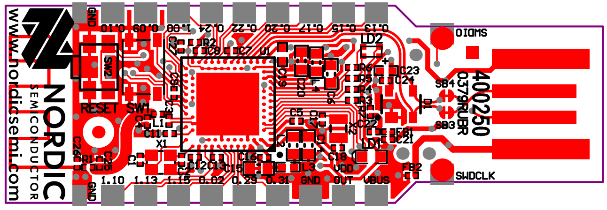
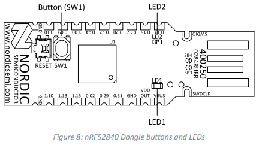

## Datasheet

[https://infocenter.nordicsemi.com/pdf/nRF52840_Dongle_User_Guide_v1.0.pdf](https://infocenter.nordicsemi.com/pdf/nRF52840_Dongle_User_Guide_v1.0.pdf)

## Pinout

## Layout

## Buttons and LEDs

| Part | Description | GPIO |
| ---- | ----------- | ---- |
| SW1 | Button | P1.06 |
| SW2 | Reset | P0.181 |
| LD1 | Green | P0.06 |
| LD2 | Red | P0.08 |
| LD2 | Green | P1.09 |
| LD2 | Blue | P0.12 |

## Zephyr Docs

[[ee.zephyr]]
[nRF52840 Dongle - Zephyr Project Documentation](https://developer.nordicsemi.com/nRF_Connect_SDK/doc/latest/zephyr/boards/arm/nrf52840dongle_nrf52840/doc/index.html)

## Programming the dongle

[How to use the NRF52840 Dongle (PCA10059) as development board](https://jimmywongiot.com/2019/10/25/how-to-use-the-nrf52840-dongle-pca10059-as-development-board/)