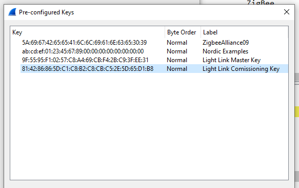
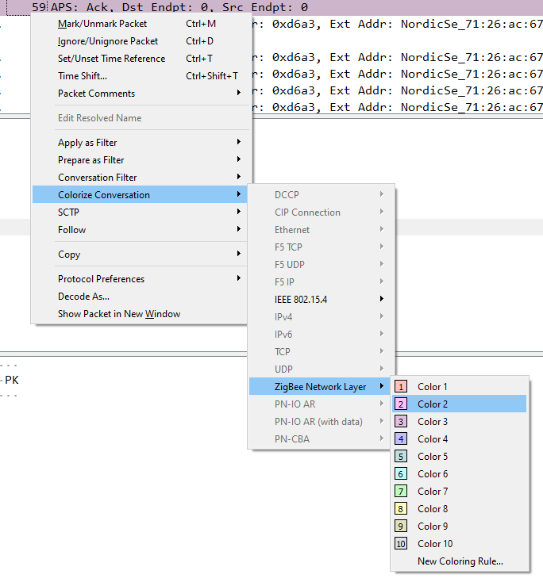
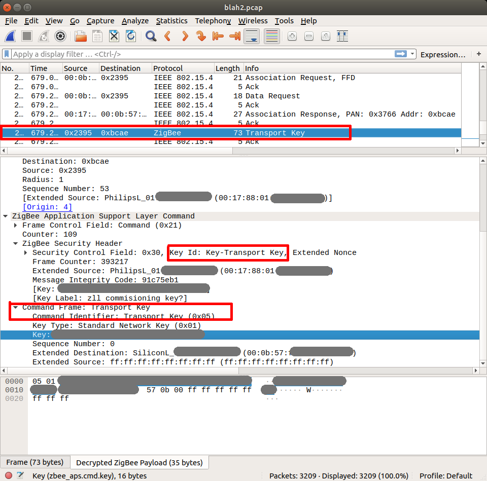
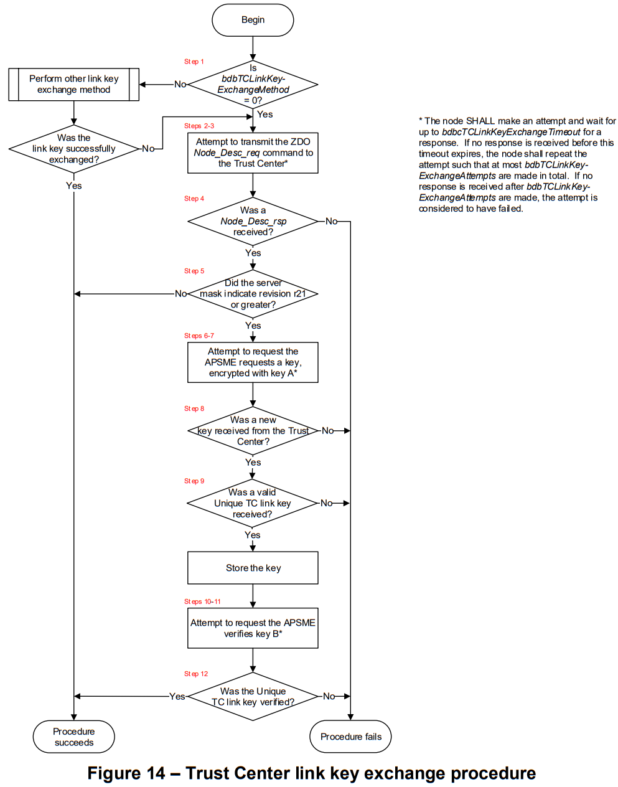

Creating [[ZigBee|ee.zb]] lightbulb to add to [[Home Assistant|ee.ha]] using the sample [[ee.nrf-connect-sdk.zb.samples.light-bulb]]

Is the Sonoff ZBridge the right version?

- [ ] ZB 3.0
- [ ] Suports TC Link

## Wireshark

### Configure for ZigBee Packet Sniffing

Steps to configure here: [nRF Sniffer for 802.15.4](https://infocenter.nordicsemi.com/topic/ug_sniffer_802154/UG/sniffer_802154/intro_802154.html)

- Installation (WireShark, ZB Sniffer Plugin, Firmware for nRF board)
  - [Installing nRF Sniffer for 802.15.4](https://infocenter.nordicsemi.com/topic/ug_sniffer_802154/UG/sniffer_802154/installing_sniffer_802154.html)

- Adding keys
  - [Configuring Wireshark for nRF Sniffer for 802.15.4](https://infocenter.nordicsemi.com/topic/ug_sniffer_802154/UG/sniffer_802154/configuring_sniffer_802154.html)

### Adding Keys

Edit > Preferences

- Protocols > ZigBee

### Filter/Colour a conversation

Right click on part of conversation:

### Filter bar

#### Filter by Source and Destination

`zbee_nwk.dst == 0xd6a3 || zbee_nwk.src == 0xd6a3`

### Acquiring a network key

Look for a packet with this format:

- Transport Key
  - ZigBee Application Support Layer Command
    - Zigbee Security Header
      - Command Frame: Transport Key
        - Key Type: Standard Network Key (0x01)

- Relevant filter: `zbee_aps.cmd.key_type == 0x01`

- Resource + Image taken from: [Sniffing Philips Hue Zigbee traffic with Wireshark](https://www.hal9k.dk/sniffing-philips-hue-zigbee-traffic-with-wireshark/)

## Troubleshootiong

## Incompatibility between Zigbee 3.0 and Zigbee Home Automation

Problem:

> Network steering was not successful (status: -1)

Response:

> I'm sorry, being new to the world of Zigbee I was not aware about the **incompatibility between Zigbee 3.0 and Zigbee Home Automation**. Zigbee HA uses its own Zigbee stack called zigpy, and in order to connect to their network our device must support and be compatible with zigpy. There is some more information about this on Home Assistant's page about Zigbee here, where they also list Zigbee radio modules that are compatible with zigpy, and ZBOSS is not listed there.
>
> There is also a discussion here about a zigpy radio library for ZBOSS, but I do not think they have a solution yet.

[Join Non-NRF Network? - Nordic Q&amp;A - Nordic DevZone - Nordic DevZone](https://devzone.nordicsemi.com/f/nordic-q-a/75186/join-non-nrf-network/310375#310375)

[[ee.ha.zha]]

[[ee.zb.devices.sonoff-zigbee-bridge]]

### Router/End device leaves network

> The TC link key exchange procedure is a feature of revision R21 and later of the Zigbee stack (so Zigbee 3.0). However, the coordinator is a legacy device (stack revision of R20 or earlier), and does not support TC link key exchange. The same is true for the Sonoff SNZB-02, which is why it is able to join the network successfully.
>
> One possible solution is to use zb_bdb_set_legacy_device_support(1) to enable legacy support on the nRF52840. Be aware that we do not recommend setting this on router devices, as it will disable TC link key exchange and will make it so the device is not compliant with Zigbee R21 or later. This is a workaround, and the cleanest solution would be to have a coordinator that is a certified R21 or R22 Zigbee device with support for TC link key exchange.

[Zigbee router leaves network autonomously after few seconds - Nordic Q&amp;A - Nordic DevZone - Nordic DevZone](https://devzone.nordicsemi.com/f/nordic-q-a/83640/zigbee-router-leaves-network-autonomously-after-few-seconds)

## Configuring Zigbee samples to work with other ecosystems

![[Permanent SDK changes|ee.nrf-connect-sdk#permanent-sdk-changes]]

> Zigbee samples in nRF Connect SDK use the centralized type of Zigbee network

- Zigbee Coordinator acts as Trust Center
  - Only the Trust Center can issue encryption keys + allow [[ee.zb.router]]s and [[ee.zb.end-device]]s into the network

> If you are connecting a Nordic Semiconductor’s device programmed with a Zigbee sample to a third-party Zigbee Coordinator, set the CONFIG_ZIGBEE_CHANNEL_SELECTION_MODE_MULTI Kconfig option for the Zigbee sample in nRF Connect SDK. This will allow your device to scan all channels to find the Coordinator’s Zigbee network.

- Set device to communicate on all channels (or at least the one that the [[ee.zb.coordinator]]) uses

![[CONFIG_ZIGBEE_CHANNEL_SELECTION_MODE_MULTI|ee.nrf-connect-sdk.kconfig#config_zigbee_channel_selection_mode_multi]]

[[ee.nrf-connect-sdk.kconfig]]

- [Configuring Zigbee samples for other ecosystems &mdash; nRF Connect SDK 1.8.99 documentation](https://developer.nordicsemi.com/nRF_Connect_SDK/doc/latest/nrf/ug_zigbee_other_ecosystems.html#ug-zigbee-other-ecosystems)
