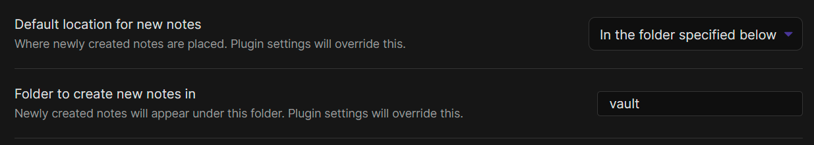
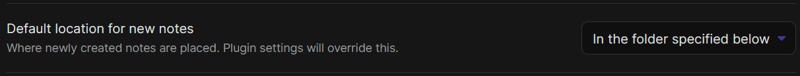
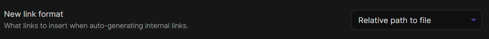
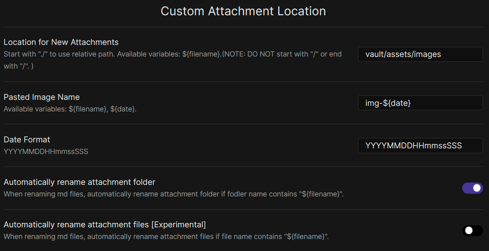
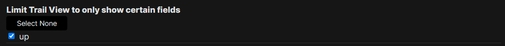
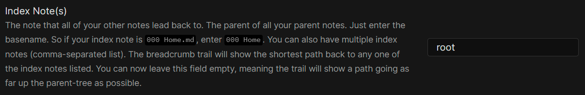
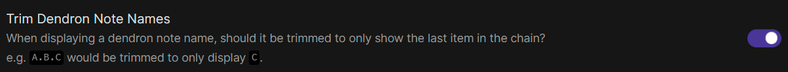

## Files and Links

- Where to create new notes

  

- Where to store attachments/images

  

- Relative links
  - Using `Shortest path when possible` will result in pasted images being linked to incorrectly
    - The image will be copied (corectly) into `assets/images` but the link will look like `` where there is no path specified. Dendron will not be able to resolve the image's location

    

- Use markdown links if you mostly add images, use wiki-links if you mostly write notes linking to other notes (this will be further addressed in the plugins section)

## Plugins

### Wikilinks to MDLinks

[agathauy/wikilinks-to-mdlinks-obsidian: An Obsidian md plugin which allows for the conversion of individually selected wikilinks to markdown links, and vice versa. (github.com)](https://github.com/agathauy/wikilinks-to-mdlinks-obsidian)

- To be explored...
  - Goal is to paste images as "markdown links" and create note links as "wiki links"

### Custom attachment location

By default, pasting images from clipboard with Obsidian will create an image filename with spaces. Dendron (markdown in general?) does not support. The following plugin allows a filename to be specified:

[RainCat1998/obsidian-custom-attachment-location: Customize attachment location with variables($filename, $data, etc) like typora. (github.com)](https://github.com/RainCat1998/obsidian-custom-attachment-location)

Relevant setings:

### Breadcrumbs

#### Views

##### Trail/Grid/Juggl

- Enable showing trail view for `up` in `Limit Trail View to only show certain fields`

  

- Specify `Index Notes(s)` as `root` (yet to see this actually take effect in trail-view)

  

#### Alternative Hierarchies

##### Dendron Notes

- Enable `Add Dendron notes to graph`

  

- Enable `Trim Dendron Note Names` (useful on mobile) and in "trail view"

  

## Outstanding Issues

- [ ] Dendron front matter (e.g. id) isn't created, so need to fun `Dendron: Doctor` command within VSCode
- [ ] Equivalent of `Dendron: Go Down` command in Obsidian
- [x] Image links created in Dendron start with `/assets`. They do not resolve in this vault within obsidian. This is likely due to root of the vault being one directory above all of the notes and the path starting with `/` being interpreted as absolute.
  - in contrast, obsidian creates links do not start with the slash and are thus relative
  - Images links in Obsidian were being prefixed with `/` due to a setting in `Dendron Paste Image` called `pasteImage.prefix="/"`
    - Changing it to `pasteImage.prefix=""` results in proper relative links that Obisidian is able to resolve
- [x] Look into how to paste images with a custom name
  - Resolved with
  - Images with spaces in the name (represented as `%`) do not get displayed in Dendron. Obisidian creates filenames with spaces for pasted images by default
  - Example: ``
    - [File links with spaces · Issue #2228 · dendronhq/dendron](https://github.com/dendronhq/dendron/issues/2228)
    - [Bug: Image Markdown fails with spaces and caps in name of file · Issue #200 · dendronhq/dendron](https://github.com/dendronhq/dendron/issues/200)

  - Workaround: immediately rename the file within Obsidian to not have spaces
    - Obsidian will update the reference to the file

- [x] Obsidian only allows ALL markdown links or ALL wikilinks while Dendron uses wiki links for notes and markdown links for images
  - Need a plugin that can paste images with markdown links while continuing to use wikilinks for note links
    - Could do manual conversation using: [GitHub - agathauy/wikilinks-to-mdlinks-obsidian: An Obsidian md plugin which allows for the conversion of individually selected wikilinks to markdown links, and vice versa.](https://github.com/agathauy/wikilinks-to-mdlinks-obsidian)
    - Shortcut is `ctrl + shift + L`
    - Is it possible to add shortcut to this command on toolbar?
	    - Yes it is!
    - Relevant FR: [Have separate &quot;Use Markdown links&quot; options for internal and external links](https://forum.obsidian.md/t/have-separate-use-markdown-links-options-for-internal-and-external-links/25527)
