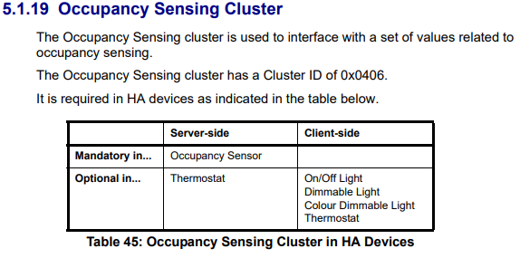
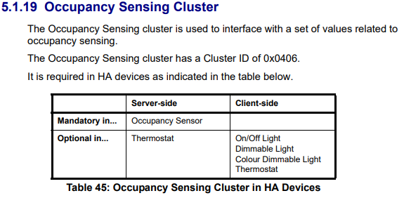
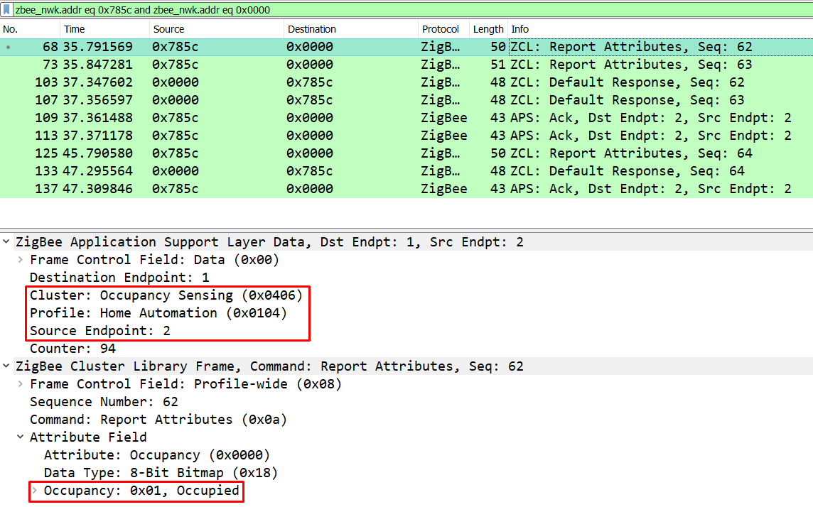

## Documentation

- ZBOSS: [Developing with ZBOSS : ZCL Occupancy Sensing cluster](https://developer.nordicsemi.com/nRF_Connect_SDK/doc/zboss_api_doc/group___z_b___z_c_l___o_c_c_u_p_a_n_c_y___s_e_n_s_i_n_g.html)

- NXP docs for their API, seems to be useful regardless of MCU as a cross reference, especially since occupancy sensing isn't really implemented by Nordic/ZBOSS: [https://www.nxp.com/docs/en/user-guide/JN-UG-3076.pdf](https://www.nxp.com/docs/en/user-guide/JN-UG-3076.pdf)

  

  - Useful for checking the dependencies of clusters e.g.

    

## Example Zigbee Traffic for Philips Hue




## ZCL Specification

![[ee.zb.zcl.measurement-and-sensing.occupancy-sensing]]

## Adding Occupancy Sensing Implementation

[Zigbee Occupancy cluster attribute setting gives Invalid Value error - Nordic Q&amp;A - Nordic DevZone - Nordic DevZone](https://devzone.nordicsemi.com/f/nordic-q-a/60960/zigbee-occupancy-cluster-attribute-setting-gives-invalid-value-error)

Whenever a customer wants to use it, than he has to define:

- Sensor-specific attribute name, e.g.:

  ```c
  #define ZB_ZCL_CLUSTER_ID_OCCUPANCY_SENSING_PIR ZB_ZCL_CLUSTER_ID_OCCUPANCY_SENSING
  ```

- Sensor-specific attribute handlers, e.g.:

  ```c
  #defineZB_ZCL_CLUSTER_ID_OCCUPANCY_SENSING_PIR_SERVER_ROLE_INIT pir_sensor_init
  ```

- The init function has to pass the write attribute hook to the stack, e.g.:

  ```c
  zb_zcl_add_cluster_handlers(ZB_ZCL_CLUSTER_ID_OCCUPANCY_SENSING_PIR,
                                ZB_ZCL_CLUSTER_SERVER_ROLE,
                                check_value_pir_sensor_server,
                                write_attr_pir_sensor_server_hook,
                                (zb_zcl_cluster_handler_t)NULL);
  ```

  - Notice that in `zb_zcl_occupancy_sensing.h` these are not defined as anything useful!

    ```
    #define ZB_ZCL_CLUSTER_ID_OCCUPANCY_SENSING_SERVER_ROLE_INIT (zb_zcl_cluster_init_t)NULL
    #define ZB_ZCL_CLUSTER_ID_OCCUPANCY_SENSING_CLIENT_ROLE_INIT (zb_zcl_cluster_init_t)NULL
    ```


## Zigbee Device Signature

- [x] Have been able to rule out that device signature being incorrect. The DUT has the sample configuration as the Philips hue, bar some extraneous clusters that I am not yet planning to use. Comparison is below:

### DUT

```json
{
  "node_descriptor": "NodeDescriptor(logical_type=<LogicalType.Router: 1>, complex_descriptor_available=0, user_descriptor_available=0, reserved=0, aps_flags=0, frequency_band=<FrequencyBand.Freq2400MHz: 8>, mac_capability_flags=<MACCapabilityFlags.AllocateAddress|RxOnWhenIdle|MainsPowered|FullFunctionDevice: 142>, manufacturer_code=4660, maximum_buffer_size=108, maximum_incoming_transfer_size=1621, server_mask=11264, maximum_outgoing_transfer_size=1621, descriptor_capability_field=<DescriptorCapability.NONE: 0>, *allocate_address=True, *is_alternate_pan_coordinator=False, *is_coordinator=False, *is_end_device=False, *is_full_function_device=True, *is_mains_powered=True, *is_receiver_on_when_idle=True, *is_router=True, *is_security_capable=False)",
  "endpoints": {
    "10": {
      "profile_id": 260,
      "device_type": "0x0101",
      "in_clusters": [
        "0x0000",
        "0x0003",
        "0x0004",
        "0x0005",
        "0x0006",
        "0x0008"
      ],
      "out_clusters": []
    },
    "11": { // Arbitrarily chosen endpoint ID
      "profile_id": 260, // Home automation profile ID
      "device_type": "0x0107", // Device type of occupancy sensor
      "in_clusters": [
        "0x0000", // Basic
        "0x0003", // Identify
        "0x0406"  // Occupancy
      ],
      "out_clusters": []
    },
    "242": {
      "profile_id": 41440,
      "device_type": "0x0061",
      "in_clusters": [],
      "out_clusters": [
        "0x0021"
      ]
    }
  },
  "manufacturer": "Nordic",
  "model": "Dimable_Light_v0.2",
  "class": "zigpy.device.Device"
}


```
### Philips Hue

```json
{
  "node_descriptor": "NodeDescriptor(logical_type=<LogicalType.EndDevice: 2>, complex_descriptor_available=0, user_descriptor_available=0, reserved=0, aps_flags=0, frequency_band=<FrequencyBand.Freq2400MHz: 8>, mac_capability_flags=<MACCapabilityFlags.AllocateAddress: 128>, manufacturer_code=4107, maximum_buffer_size=89, maximum_incoming_transfer_size=63, server_mask=0, maximum_outgoing_transfer_size=63, descriptor_capability_field=<DescriptorCapability.NONE: 0>, *allocate_address=True, *is_alternate_pan_coordinator=False, *is_coordinator=False, *is_end_device=True, *is_full_function_device=False, *is_mains_powered=False, *is_receiver_on_when_idle=False, *is_router=False, *is_security_capable=False)",
  "endpoints": {
    "1": {
      "profile_id": 49246,
      "device_type": "0x0850",
      "in_clusters": [
        "0x0000"
      ],
      "out_clusters": [
        "0x0000",
        "0x0003",
        "0x0004",
        "0x0005",
        "0x0006",
        "0x0008",
        "0x0300"
      ]
    },
    "2": { // Arbitrarily chosen endpoint ID
      "profile_id": 260, // Home automation profile ID (x)
      "device_type": "0x0107", // Device type of occupancy sensor (x)
      "in_clusters": [
        "0x0000", // Basic (x)
        "0x0001", // Power config
        "0x0003", // Identify (x)
        "0x0400", // Illuminance
        "0x0402", // Tempearture measurement
        "0x0406" // Occupancy (x)
      ],
      "out_clusters": [
        "0x0019" // OTA Upgrade
      ]
    }
  },
  "manufacturer": "Philips",
  "model": "SML001",
  "class": "zhaquirks.philips.motion.PhilipsMotion"
}
```
