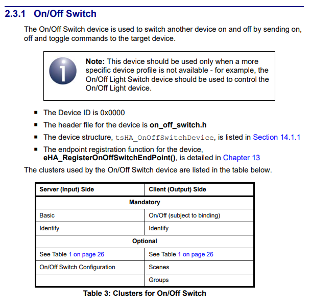

## Reference Device Signature

[[proj.zb-home-automation.on-off-switch.device-signature]]

Requires implementation of [[ee.zb.zcl.general.on-off-switch-configuration]] which is lacking from nRF Connect at the moment. Required:

- `zb_zcl_on_off_switch_config_addons.h`

Declare with cluster attrs with

- `ZB_ZCL_DECLARE_ON_OFF_SWITCH_CONFIGURATION_ATTRIB_LIST`

Declare cluster list with:

- `ZB_HA_DECLARE_ON_OFF_SWITCH_CLUSTER_LIST`

Declare end point with:

- `ZB_HA_DECLARE_ON_OFF_SWITCH_EP`

Declare context with:

- `ZBOSS_DECLARE_DEVICE_CTX_2_EP`