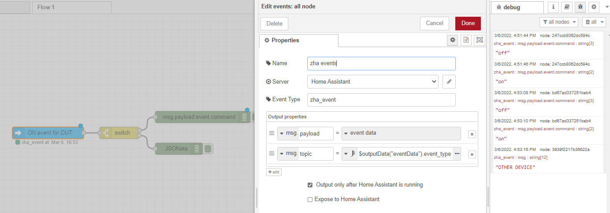

## Implementing Attributes, Clusters and Endpoint

Requires implementation of [[ee.zb.zcl.general.on-off-switch-configuration]] which is lacking from nRF Connect at the moment. Required:

- `zb_zcl_on_off_switch_config_addons.h`

Declare with cluster attrs with

- `ZB_ZCL_DECLARE_ON_OFF_SWITCH_CONFIGURATION_ATTRIB_LIST`

Declare cluster list with:

- `ZB_HA_DECLARE_ON_OFF_SWITCH_CLUSTER_LIST`

Declare end point with:

- `ZB_HA_DECLARE_ON_OFF_SWITCH_EP`

Declare context with:

- `ZBOSS_DECLARE_DEVICE_CTX_2_EP`

## Device Signature

[[proj.zb-home-automation.on-off-switch.device-signature]]

## 2022.03.06 - ZHA does not recognise button triggers

[[ee.ha.zha]] does not recognise that the device has triggers such as on/off for the On/Off client cluster despite the device signature containing the mandatory clusters.

- [x] Investigate [[ee.zb.zcl.general-command-frames.discover-comands-generated]] command
  - The [[ee.ha.zha.tradfri-remote]] does not receive the `discover commands generated command` during pairing so this is likely not the way that it tells [[ee.ha.zha]] the commands that it will send
    - There is still a chance that the [[ee.zb.coordinator]] simply remembered the device and did not issue the command
      - Currently unsure how to guarantee a device is completely wiped from ZHA

  ![[Discover Comands Generated|ee.zb.zcl.general-command-frames.discover-comands-generated]]

- [ ] [[ee.ha.zha.quirks]]
  - Either create a quirk for zigpy implementing `device_automation_triggers` OR
    - [[device_automation_triggers|ee.ha.zha.quirks#device_automation_triggers]]
  - Match the profile for a quirk with the cluster list, manufacturer ID, etc to make use of existing quirks...
    - This would be inflexible as it would represent a specific device and nothing else e.g. 5 button tradfri remote
- [ ] [[ee.ha.device-automations.triggers]]
  - Specifying triggers at the Home Assistant level instead of the ZHA plugin level

- [x] Capture/respond to on/off commands within [[ee.ha]]
  - Listen for events =>
    - Filter `zha_event` => switch on the device ID

    

  - Switch on the event ID

    

  - Extract command from the payload and output to `debug`

    